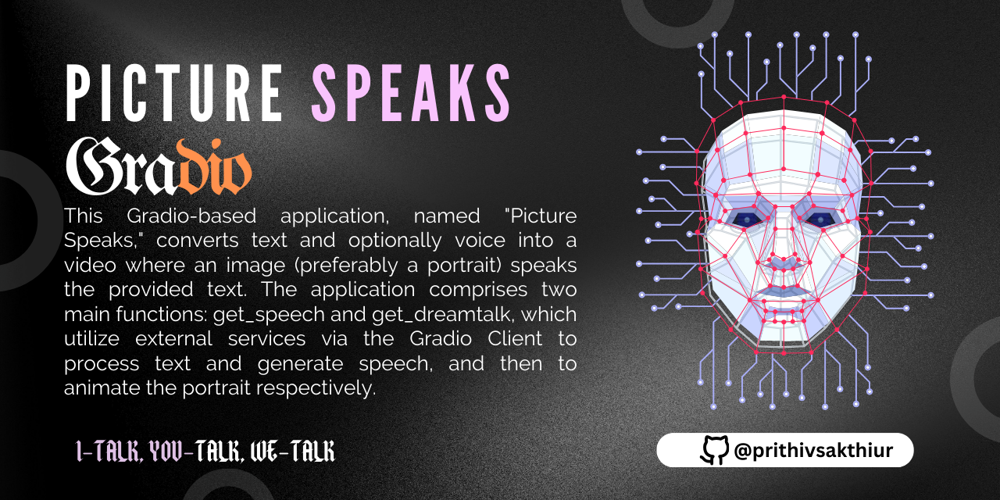
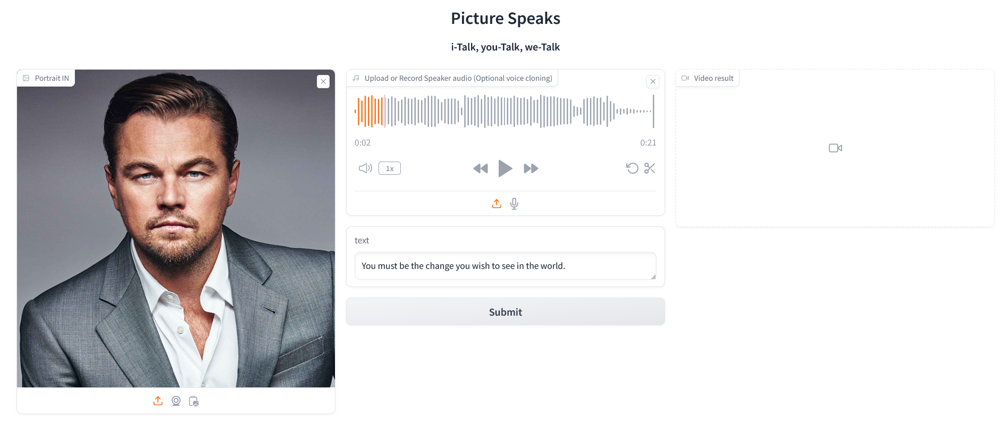

🚀Check out the configuration reference at : https://huggingface.co/docs/hub/spaces-config-reference

🚀Huggingface space : https://huggingface.co/spaces/prithivMLmods/i-Talk

🚀Git Clone with Huggingface All Files : git clone https://huggingface.co/spaces/prithivMLmods/i-Talk

## 🗣️Uploading Vioce Sample to Infer & Adding Prompt For Conversion

## 🫙Taking Face / Picture Speaks

.

.

.
